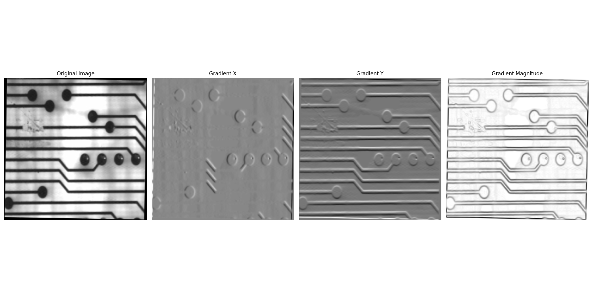

# Image Processing Project

This project focuses on rebuilding basic image processing methods. Currently, it includes methods for image processing using histograms and filters.

## Histogram-based Processing
1. Extract histogram information from an image
2. Binarize an image using a constant threshold
3. Binarize an image using Otsu's method (2 approaches)
4. Contrast adjustment: histogram equalization using linear and non-linear functions

## Filter-based Processing
1. Filtering via discrete convolution
2. Low-pass filtering (Blurring): Average Filter, Gaussian Filter
3. High-pass filtering: detail enhancement, structure detection, contour detection, Median filter, Conservative filter.
