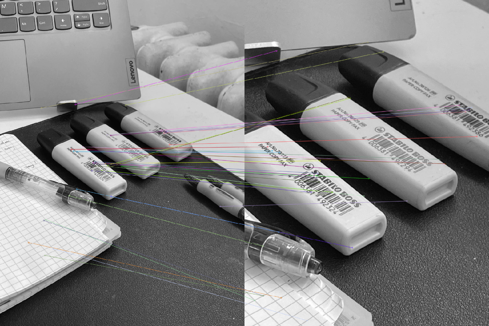
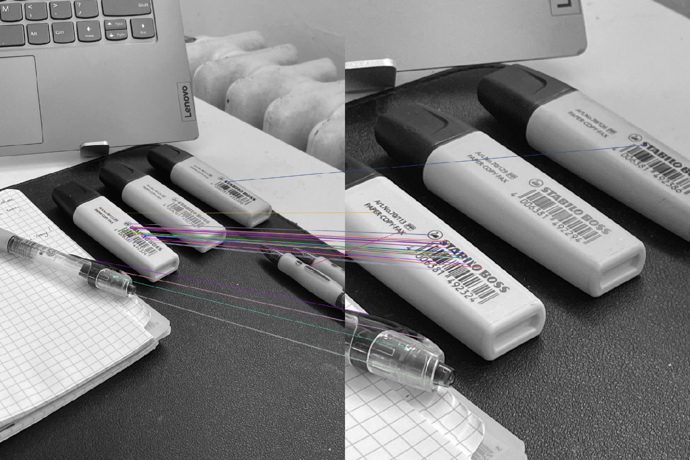

# Image Processing Project

This project focuses on rebuilding basic image processing methods. Currently, it includes methods for image processing using histograms and filters.

## Histogram-based Processing
1. Extract histogram information from an image
2. Binarize an image using a constant threshold
3. Binarize an image using Otsu's method (2 approaches)
4. Contrast adjustment: histogram equalization using linear and non-linear functions

## Filter-based Processing
1. Filtering via discrete convolution
2. Low-pass filtering (Blurring): Average Filter, Gaussian Filter
3. High-pass filtering: detail enhancement, structure detection, contour detection, Median filter, Conservative filter.

## SIFT - Scale-invariant feature transform
In this project, I learned how to build this method from scratch. It will include the following steps:

- **Construction of the multi-scale pyramid**
- **Detection of local extrema**
- **Relocation of keypoints**
- **Elimination of keypoints located on low-curvature contours**
- **Assignment of an orientation**
- **Computation of local descriptors**

Although the calculation time is longer than openCV library, the result is still acceptable.

## Results

1. **SIFT Detected Keypoints**:  
   Image showing keypoints detected using the SIFT algorithm.

   

2. **SIFT Matches**:  
   Image showing the matching keypoints between two images using the SIFT algorithm.

   

3. **ORB Matches**:  
   Image showing the matching keypoints between two images using the ORB algorithm.

   

## References
- SIFT Algorithm: https://github.com/hakimhassani97/SIFT and https://www.cs.ubc.ca/~lowe/papers/ijcv04.pdf
